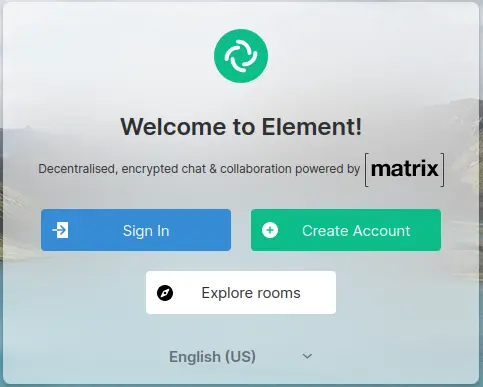
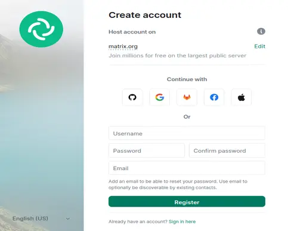

##### We are on matrix.org where you can interact with other members:

* [Link to our Matrix.org space](https://matrix.to/#/!ZUcQYrEZXbiXFdiEoT:matrix.org?via=matrix.org)

That's it! By joining, you agree to follow the community rules mentioned on this [page](). So, make sure you have read the rules. If you are new to matrix, you may follow the quick start guide below otherwise skip to [Who Should Join?](/docs/commet/how-to-join/#who-should-join)
   
>**A little Quick start: tutorial to get started with matrix if you are new.**
 
>*We're gonna use element webapp here in the tutorial. If you want, you can use any other app that uses matrix*.
 
>
>* Head to the [Element Website](https://app.element.io). It should open a page something like the image below and then click on "Create account"
>
   
>
   
>
>* Choose your preffered method of sign-up, fill details, click on "Register" and that's it! You now have an account on Matrix.
>
   
>
   
>
>* Visit the [invite link](https://matrix.to/#/!ZUcQYrEZXbiXFdiEoT:matrix.org?via=matrix.org) while signed up and join our space.
>
>*You may install the element app as well for your OS if you want to. Though Element works well on the browsers too.*
>
   

### Who should join?

I have already explained it well in the [Introduction page](), I believe. But if you are running short of time, here's a bit about it (though I believe you should read the Introduction page thoroughly at least once before joining):

Anyone who wishes to upload or who already uploads educational torrents. Anyone, could just be a student who is just interested in accessing such torrents, a seeder who seeks to help the community, someone who wants to interact with other members or uploaders to request content or for any other reason, someone who found a dead torrent from our community and wishes someone else who has it to seed it, or someone who is just curious about such torrents or about COMMET.
